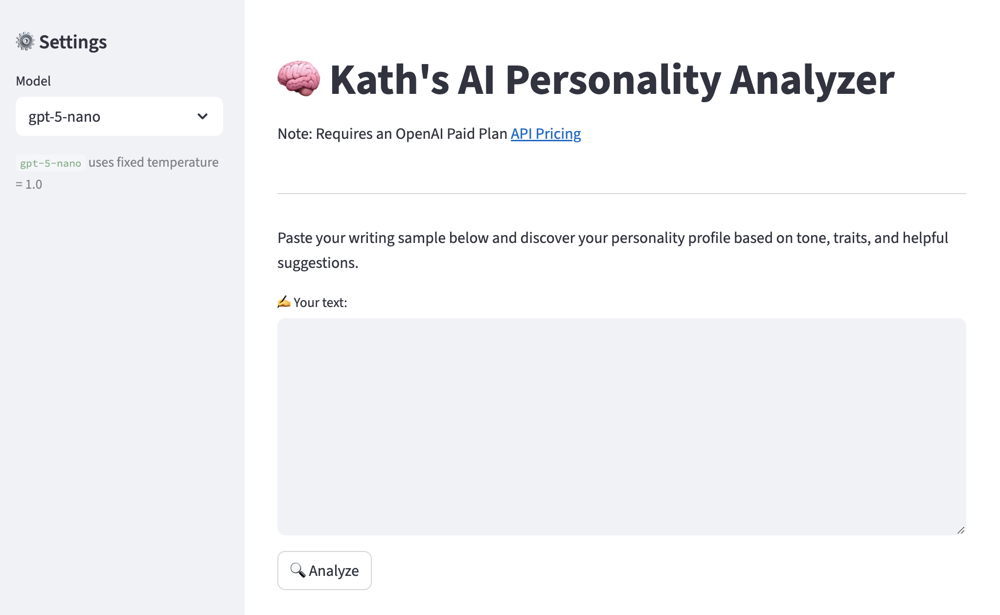
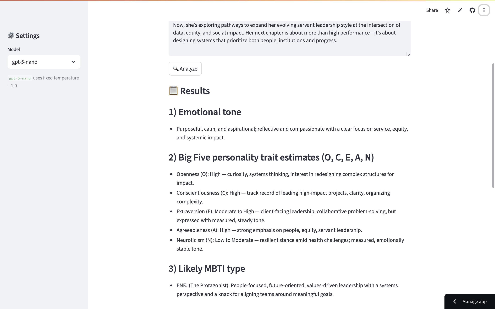
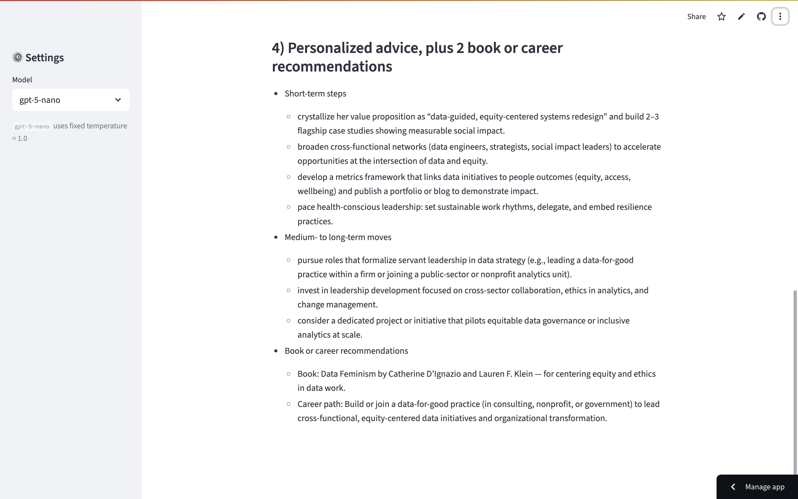

# AI Personality Analyzer App
AI Personality Analyzer 

Goal: Allow users to input a text sample (e.g., journal entry, tweet, or essay) and receive:  
(1) A psychological personality profile (e.g., Big Five / MBTI)  
(2) Strengths, growth areas, and emotional tone  
(3) Suggested self-help tips, career ideas, or book recs

Give it a try!
https://personalityfun.streamlit.app/

# Result Example:

